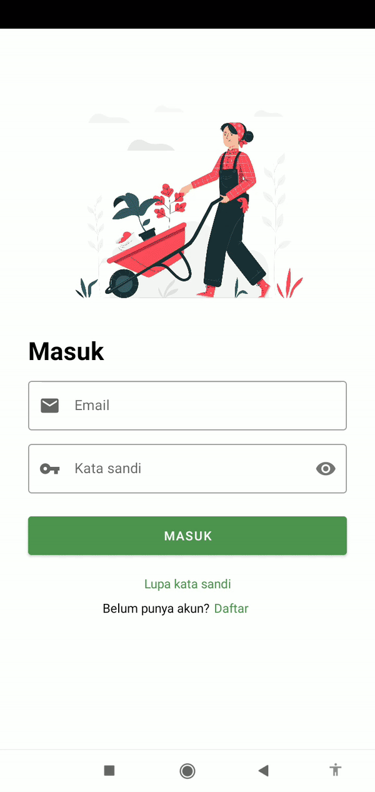
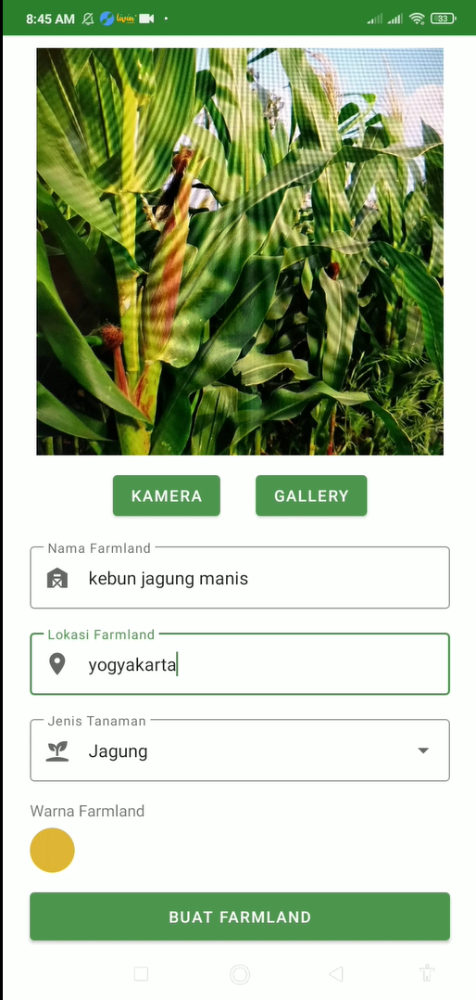
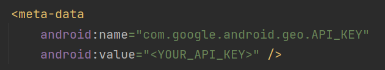

# Farmer Nusantara Android App

This is repository for Farmer Nusantara Android App Development. 

## Libraries We Use
- [Navigation component](https://developer.android.com/guide/navigation)
- [Tensorflow lite](https://www.tensorflow.org/lite/android)
- [Data binding](https://developer.android.com/topic/libraries/data-binding)
- [Datastore](https://developer.android.com/topic/libraries/architecture/datastore)
- [Retrofit2](https://github.com/square/retrofit)
- [Gson](https://github.com/google/gson)
- [Glide](https://github.com/bumptech/glide)
- [Color picker](https://github.com/yukuku/ambilwarna)
- [Dexter](https://github.com/Karumi/Dexter)

## Demo    
<h3 align="center"> Authorization </h3>

    
    

<h3 align="center"> Scan Disease </h3>

    
    

<h3 align="center"> Map Disease </h3>

    

## Run on Your Computer: 
Prerequisites for running the app:
- [Git installed](https://git-scm.com/downloads)
- [Android Studio minimal version Chipmunk 2021.2.1](https://developer.android.com/studio/archive?hl=en)
- Have a Google Cloud Platform account

How to clone to your computer:
- Open Git Bash terminal
- Type 'git clone git@github.com:farmer-nusantara/farmer-nusantara-mobile.git' or 'git clone https://github.com/farmer-nusantara/farmer-nusantara-mobile.git'
- It will clone this repository to your local computer, after cloning process is finished you can open it using Android Studio
- [Generate Google Maps API Key](https://developers.google.com/maps/get-started)
- Copy your API key to AndroidManifest.xml in meta-data tag

    

## Install on Android: 
[Download](https://drive.google.com/file/d/1N0C4iRcGkXy2cVX2eCLO0TPDgfAzhBe-/view?usp=sharing)
